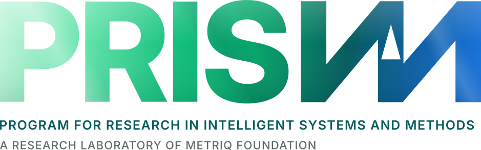

<picture>
  <source media="(prefers-color-scheme: dark)" srcset="assets/branding/Metriq_PRISM_Full_Name_Lockup_Color_Dark.svg">
  <source media="(prefers-color-scheme: light)" srcset="assets/branding/Metriq_PRISM_Full_Name_Lockup_Color_Light.svg">
  
</picture>

# Metriq PRISM Laboratory

Metriq PRISM Laboratory is an interdisciplinary research laboratory of [Metriq Foundation, Inc.](https://metriq.org). PRISM conducts exploratory research involving computational, mathematical, scientific, and machine-assisted methods.

This repository is the canonical public record for PRISM research preprints, source materials, verification code, figures, revision histories, and reproducibility packages.

> [!IMPORTANT]
> The manuscripts in this repository are exploratory research preprints. Unless a paper explicitly states otherwise, it has **not undergone independent peer review** and must not be represented as an established resolution of an open problem.

## Research program

PRISM develops and evaluates candidate results through a structured computational research process that may include:

- construction and counterexample search;
- symbolic and numerical analysis;
- literature and prior-art review;
- formal proof development;
- exact and independent computational checks;
- reproducible figure and manuscript generation;
- targeted adversarial review and revision.

Generative artificial intelligence and other computational systems may be used as research instruments. Their use does not constitute independent verification. Metriq Foundation, acting through PRISM, determines what is published and accepts responsibility for issuing each work as a candidate result.

## Mathematics preprints

| ID | Current version | Title | Materials |
|---|---:|---|---|
| **MF-MATH-2026-01** | 1.2 | An Explicit Cantorval Achievement Set with Convergent Consecutive-Term Ratio | [Paper and source](Papers/MF-MATH-2026-01/) |
| **MF-MATH-2026-02** | 1.2 | An Achievable Cantorval with Full-Dimensional Boundary | [Paper and source](Papers/MF-MATH-2026-02/) |
| **MF-MATH-2026-03** | 1.3 | Every Infinite Achievement Set Is a Sum of Two Achievement Sets of Hausdorff Dimension Zero | [Paper and source](Papers/MF-MATH-2026-03/) |
| **MF-MATH-2026-04** | 1.1 | An Achievable Cantorval with Zero-Dimensional Boundary | [Paper and source](Papers/MF-MATH-2026-04/) |
| **MF-MATH-2026-05** | 1.1 | Sharpness of the Exponential Constant in a Sumset Criterion for Fast Achievement Sets | [Paper and source](Papers/MF-MATH-2026-05/) |
| **MF-MATH-2026-06** | 2.1 | Finite Certificates for Three Unresolved Cardinal-Function Ranges | [Paper and source](Papers/MF-MATH-2026-06/) |
| **MF-MATH-2026-08** | 1.1 | Endpoint Walks Evaluate the Complete Homogeneous Symmetric Norms of Path Graphs | [Paper and source](Papers/MF-MATH-2026-08/) |
| **MF-MATH-2026-09** | 1.0 | A Bessel-Factorization Proof of Mathar's Recurrence for Type-ace Lattice Walks | [Paper and source](Papers/MF-MATH-2026-09/) |

The identifier **MF-MATH-2026-07** is intentionally not assigned to a current standalone paper. Earlier working material was consolidated into MF-MATH-2026-06. See [`IDENTIFIER_AND_SUPERSESSION_RECORD.md`](IDENTIFIER_AND_SUPERSESSION_RECORD.md).

## Publication history and provenance

MF-MATH-2026-01 was first published as Version 1.0 on **15 July 2026**. That original public release remains preserved in the [`v1.0.0` Git tag](https://github.com/MetriqOrg/PRISM/tree/v1.0.0), the repository commit history, and [`Superseded/MF-MATH-2026-01_v1.0-original-release/`](Superseded/MF-MATH-2026-01_v1.0-original-release/). The current Version 1.2, released on 16 July 2026, updates the paper without replacing or obscuring its original publication record.

Current files are never substituted silently for an earlier version. Every correction or revision receives a new version number, and superseded material remains traceable through a tagged release, a clearly marked archival directory, or both.

## Repository structure

```text
.
├── README.md
├── CATALOG.md
├── CATALOG.json
├── RESEARCH_STATUS.md
├── CONTRIBUTING.md
├── CITATION.cff
├── CHANGELOG.md
├── DISCLAIMER.md
├── IDENTIFIER_AND_SUPERSESSION_RECORD.md
├── RELEASE_NOTES.md
├── QA_REPORT.md
├── LICENSE
├── LICENSE-CONTENT
├── LICENSE-CODE
├── TRADEMARKS.md
├── Papers/
│   └── MF-MATH-YYYY-NN/
│       ├── README.md
│       ├── <canonical-paper>.pdf
│       ├── <cover>.png
│       ├── <source-and-reproducibility>.zip
│       └── SHA256SUMS.txt
├── Superseded/
│   └── <clearly-labeled-historical-release>/
├── assets/
│   └── branding/
└── .github/
    ├── ISSUE_TEMPLATE/
    └── PULL_REQUEST_TEMPLATE.md
```

Each canonical paper directory should contain only the current release and its associated assets. Superseded files should be retained in a clearly marked archival directory or GitHub release, not mixed with the current publication files.

## Research status and review

The repository distinguishes among:

- **candidate result** — issued by PRISM but not independently peer reviewed;
- **internally audited** — checked within the Metriq/PRISM research process;
- **independently reviewed** — examined by an unaffiliated qualified specialist;
- **peer reviewed** — accepted through a recognized scholarly peer-review process;
- **corrected or withdrawn** — materially revised or no longer advanced in its prior form.

Internal symbolic checks, exhaustive finite computation, reproducible builds, or AI-assisted review are not described as independent validation.

Current review information is maintained in [`RESEARCH_STATUS.md`](RESEARCH_STATUS.md).

## Independent mathematical review

PRISM expressly invites rigorous examination of every candidate result.

Useful submissions include:

- identification of a specific invalid inference or missing hypothesis;
- a counterexample to a stated lemma or theorem;
- independent reproduction of a computational certificate;
- relevant prior art or an earlier equivalent construction;
- corrections to references, problem statements, or attribution;
- clearer proofs that preserve the mathematical substance.

Open a **Proof Review** or **Erratum / Correction** issue using the repository templates. Substantive criticism will not be removed merely because it challenges a PRISM result.

## Reproducibility

Where applicable, releases include:

- complete LuaLaTeX source;
- bibliography and source figures;
- exact-arithmetic or symbolic verification scripts;
- recorded verification output;
- build instructions;
- checksums;
- a targeted independent-review guide.

A successful build or verification run confirms reproducibility of the stated computation or document. It does not by itself establish novelty or mathematical correctness.

## Citation

Use the citation metadata in [`CITATION.cff`](CITATION.cff) for the repository as a whole. Each paper should also include its own preferred citation in its directory-level `README.md` and, where practical, a paper-specific `CITATION.cff`.

Cite the exact paper version reviewed. Do not cite a mutable branch when a tagged release or DOI is available.

## Institutional disclosure

The following disclosure applies to PRISM candidate manuscripts unless a paper contains a more specific statement:

> This manuscript is an exploratory research preprint issued by the Metriq PRISM Laboratory, an interdisciplinary research laboratory of Metriq Foundation, Inc. PRISM—the Program for Research in Intelligent Systems and Methods—conducts research involving computational, mathematical, scientific, and machine-assisted methods.
>
> The work was developed as part of PRISM’s experimental research program in computationally assisted mathematics. Metriq Foundation, acting through the PRISM Laboratory, directed the research process, evaluated the resulting argument, determined the form and scope of the manuscript, and accepts responsibility for its publication as a candidate result.
>
> Generative artificial intelligence and other computational tools were used as research instruments to support construction search, symbolic and numerical analysis, literature review, proof development, verification, and manuscript preparation. Their use does not constitute independent validation of the results presented.
>
> This manuscript has not yet undergone independent peer review and should not be regarded as an established resolution of the stated problem unless and until its arguments have been examined and confirmed by qualified mathematicians. Independent verification, criticism, replication, and identification of errors are expressly invited.

The standalone version is maintained in [`DISCLAIMER.md`](DISCLAIMER.md).

## Licensing

This repository uses a split-license structure:

- research manuscripts, original figures, and documentation: **CC BY 4.0**;
- verification scripts and other software: **MIT License**;
- Metriq and PRISM names, logos, wordmarks, and trade dress: **not licensed for general reuse**.

See [`LICENSE`](LICENSE), [`LICENSE-CONTENT`](LICENSE-CONTENT), [`LICENSE-CODE`](LICENSE-CODE), and [`TRADEMARKS.md`](TRADEMARKS.md).

Third-party materials remain subject to their respective licenses and rights notices.

## About Metriq Foundation

Metriq Foundation, Inc. is a Florida-based technology nonprofit. PRISM is one of its research programs and operates under the Foundation’s institutional direction.

**Website:** [metriq.org](https://metriq.org)
